# Golang-learn
Exercise from https://www.bilibili.com/video/BV1XY4y1t76G/?p=31&amp;spm_id_from=333.1007.top_right_bar_window_history.content.click

# 1. Gin框架

Gin最擅长Api接口的高并发。如果业务简单、规模不大，就使用Gin。

如果从一个新项目开始，就要执行go的初始化。

```cmd
go mod init Golang-learn
go get -u github.com/gin-gonic/gin
```

```go
package main

import "github.com/gin-gonic/gin"

func main() {
	// 创建路由引擎
	r := gin.Default()
	r.GET("/", func(c *gin.Context) {
		c.String(200, "Hello World")
	})
	r.Run(":8080")
}
```

上面就是一个简单的Go项目。

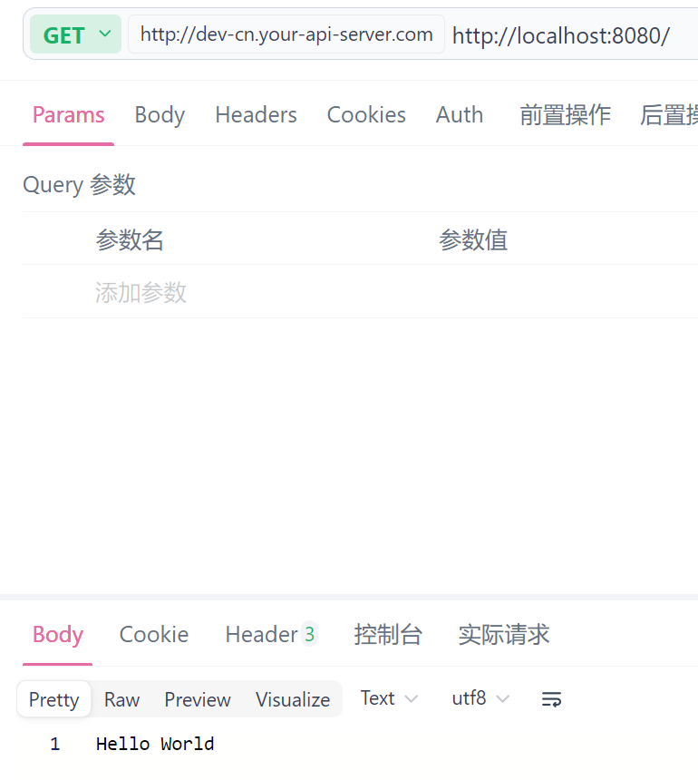

## 1.1 响应数据

获取到`gin.Default()`后，有多种方法能够创建路由并返回数据。比如在页面中返回`c.JSON()`，浏览器会显示JSON数据；`c.String()`在浏览器显示字符串；`c.JSONP()`会显示包裹在回调函数内的JSON数据；`c.XML()`会显示xml数据，`c.HTML()`会在浏览器显示html数据。

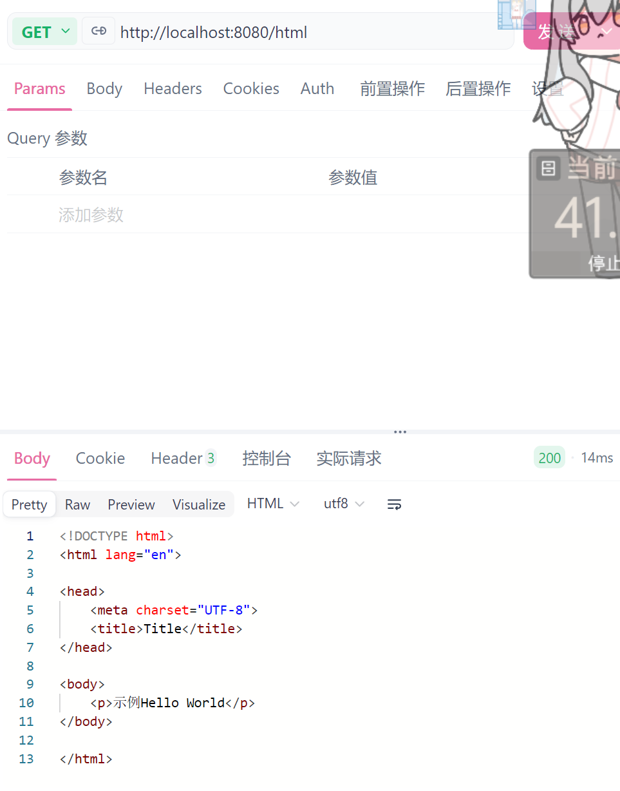

## 1.2 GET和POST传值

### 1.2.1 Get传值

Get传值主要通过路径携带参数。而从路径上获取参数，只需要在GET请求的路径上添加`/:${value}`即可，其中`${value}`指变量名。这样，在请求内可通过`c.Query(value)`来获取该变量。

```go
package main

import (
	"fmt"

	"github.com/gin-gonic/gin"
)

func main() {
	r := gin.Default()
	r.GET("/:age", func(c *gin.Context) {
		// 在上下文中添加参数
		c.Set("username", "小张")
		// 从上下文中获取参数
		username, _ := c.Get("username")
		// 从URL中获取参数，如果没有则使用默认值
		age := c.DefaultQuery("age", "30")
		c.JSON(200, gin.H{
			"username": username,
			"age":      age,
		})
		fmt.Println(username, age)
	})

	r.Run(":8080")
}
```

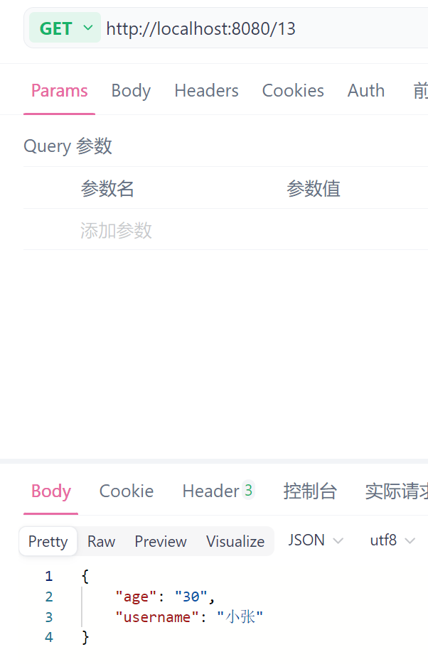

### 1.2.2 POST传值

POST请求的参数会保存在请求体中，通过`c.PostForm`和`c.DefaultPostForm`来获取。

```go
package main

import (
	"github.com/gin-gonic/gin"
)

func main() {
	r := gin.Default()
	// POST传值
	r.POST("/login", func(c *gin.Context) {
		id := c.DefaultPostForm("id", "0")
		password := c.PostForm("password")
		c.JSON(200, gin.H{
			"id":       id,
			"password": password,
		})
	})

	r.Run(":8080")
}
```

值得注意的是，这种方法只能接收请求中的`form-data`，这样才能接收参数。如果请求体的参数以JSON的形式来传输，就无法接收。

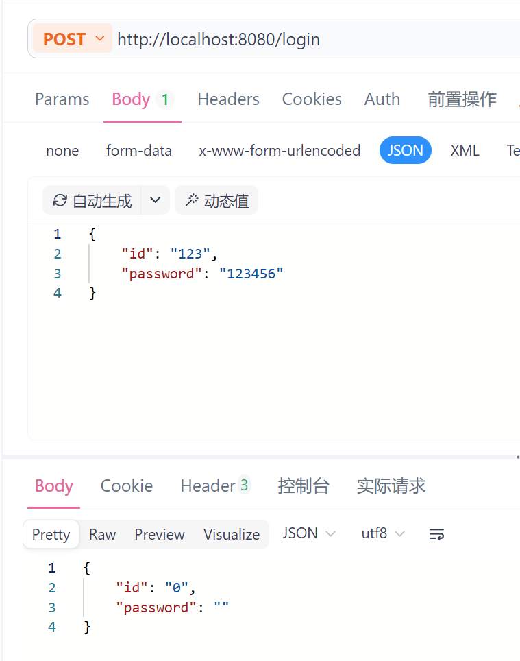

想要获取请求体中的JSON数据，就要使用结构体，保证结构体的属性包含请求体内的所有参数。

```go
package main

import (
	"github.com/gin-gonic/gin"
)

// UserRequest 接收POST请求的结构体
type UserRequest struct {
	// json表示请求中的变量名
	Username string `json:"username"`
	Password string `json:"password"`
}

func main() {
	r := gin.Default()
	// POST的JSON传值
	r.POST("/user", func(c *gin.Context) {
		var req UserRequest
		// 使用ShouldBind绑定JSON数据到结构体
		if err := c.ShouldBind(&req); err != nil {
			c.JSON(400, gin.H{"error": err.Error()})
			return
		}
		// 获取到包含参数的结构体，可以返回到页面上
		c.JSON(200, gin.H{
			"username": req.Username,
			"password": req.Password,
		})
	})

	r.Run(":8080")
}
```

这样，就能获取到JSON数据。

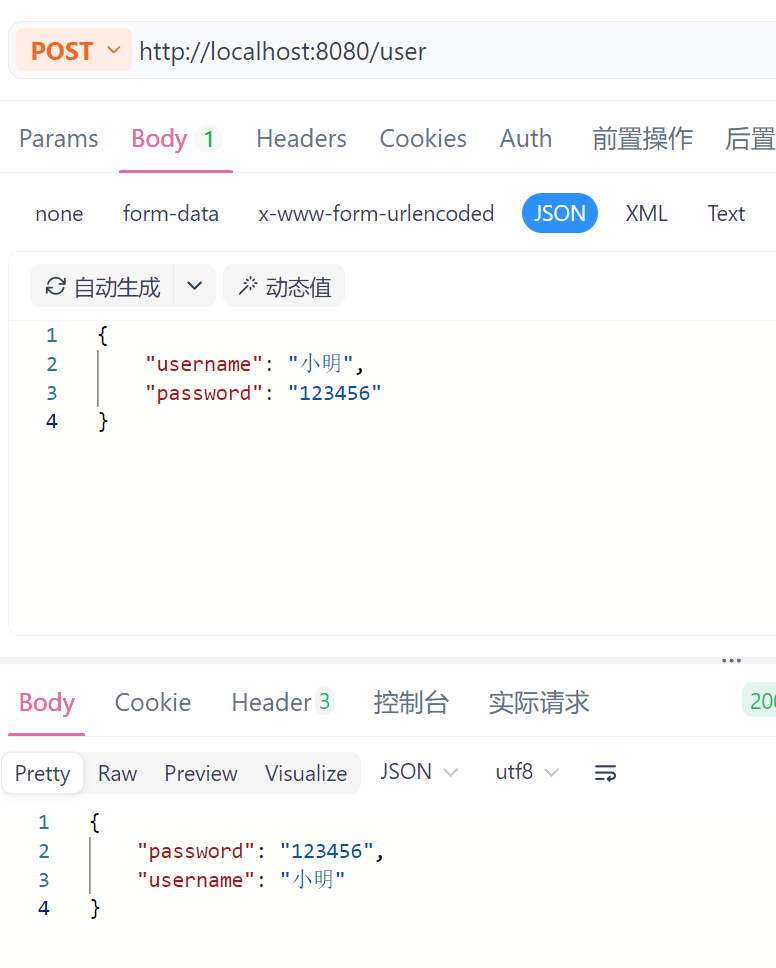

### 1.2.3 XML传值

xml传值前，需要为结构体添加xml的Tag，才能识别xml的变量。

```go
package main

import (
	"encoding/xml"
	"net/http"

	"github.com/gin-gonic/gin"
)

// UserRequest 接收POST请求的结构体
type UserRequest struct {
	// json表示请求中的变量名
	Username string `json:"username" xml:"username"`
	Password string `json:"password" xml:"password"`
}

func main() {
	r := gin.Default()
	// POST的XML传值
	r.POST("/user/xml", func(c *gin.Context) {
		// 获取xml数据
		b, _ := c.GetRawData()
		user := &UserRequest{}
		// 通过反序列化，将xml数据绑定到结构体上
		if err := xml.Unmarshal(b, user); err == nil {
			c.JSON(http.StatusOK, user)
		} else {
			c.JSON(http.StatusBadRequest, err.Error())
		}
	})

	r.Run(":8080")
}
```

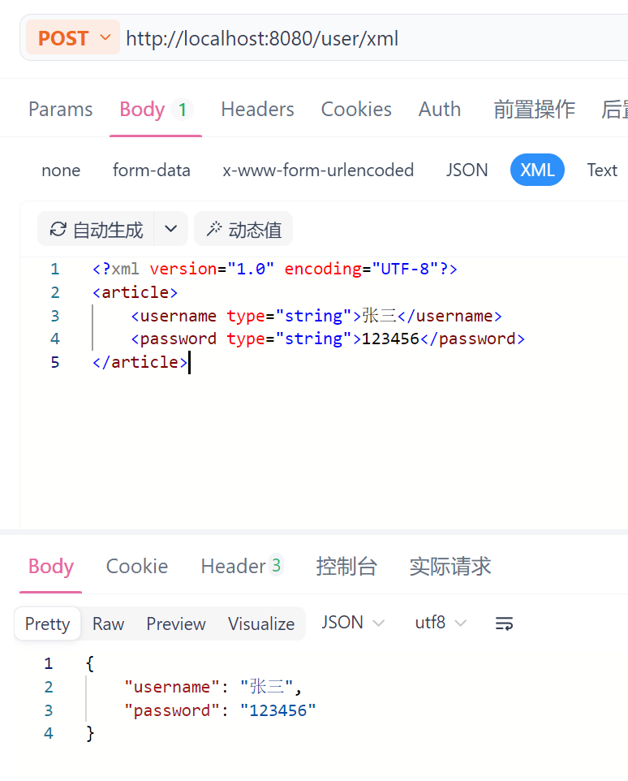

## 1.3 路由分组

如果将所有的路由使用`r.GET`、`r.POST`等配置在main函数中，会导致代码复杂。因此需要对路由进行分组。

```go
package main

import (
	"github.com/gin-gonic/gin"
)

func main() {
	r := gin.Default()

	//路由分组
	defaultRouters := r.Group("/")
	{
		// 获取分组后的路由来拼接路径
		defaultRouters.GET("/", func(c *gin.Context) {
			c.String(200, "首页")
		})
		defaultRouters.GET("/news", func(c *gin.Context) {
			c.String(200, "新闻")
		})
	}
	// 路由分组
	apiRouters := r.Group("/api")
	{
		apiRouters.GET("/", func(c *gin.Context) {
			c.JSON(200, gin.H{
				"message": "api首页",
			})
		})
		apiRouters.GET("/news", func(c *gin.Context) {
			c.JSON(200, gin.H{
				"message": "api新闻",
			})
		})
	}
	r.Run(":8080")
}
```

第一个路由组的路径是`localhost:8080/`，第二个路由组是`localhost:8080/api/`。而路由组下的路由是根据这些路径来继续拼接的。

这样，可以将不同的路由放到不同的文件中分开维护。

`main.go`。

```go
package main

import (
	"Golang-learn/Demo3/routers"

	"github.com/gin-gonic/gin"
)

func main() {
	r := gin.Default()

	routers.InitDefaultRouters(r)
	routers.InitApiRouters(r)
	r.Run(":8080")
}
```

`routers/apiRouters.go`。

```go
package routers

import "github.com/gin-gonic/gin"

// InitApiRouters 初始化API路由
func InitApiRouters(r *gin.Engine) {
	// 路由分组
	apiRouters := r.Group("/api")
	{
		apiRouters.GET("/", func(c *gin.Context) {
			c.JSON(200, gin.H{
				"message": "api首页",
			})
		})
		apiRouters.GET("/news", func(c *gin.Context) {
			c.JSON(200, gin.H{
				"message": "api新闻",
			})
		})
	}
}
```

`routers/defaultRouters.go`。

```go
package routers

import "github.com/gin-gonic/gin"

// InitDefaultRouters 初始化默认路由
func InitDefaultRouters(r *gin.Engine) {
	defaultRouters := r.Group("/")
	{
		// 获取分组后的路由来拼接路径
		defaultRouters.GET("/", func(c *gin.Context) {
			c.String(200, "首页")
		})
		defaultRouters.GET("/news", func(c *gin.Context) {
			c.String(200, "新闻")
		})
	}
}
```

这样就实现了路由分组，让main文件显得干净易维护。

## 1.4 自定义控制器

Gin本身并没有控制器，但能够使用普通函数来完成类似Java内的Controller的功能。

在一般的项目中，通常会将监听路径`c.GET`与触发的函数分离。

```go
c.GET("/login", Login) // Login方法在其他文件实现
```

将上面的路由分组的触发函数进行分开。

`controllers/default/defaultController.go`。

```go
package _default

import "github.com/gin-gonic/gin"

// ShowHomePage 加载首页，对应defaultRouter.GET的"/"路径
func ShowHomePage(c *gin.Context) {
	c.String(200, "首页")
}

// ShowNewsPage 加载新闻，对应defaultRouter.GET的"/news"路径
func ShowNewsPage(c *gin.Context) {
	c.String(200, "新闻")
}
```

`controllers/api/apiControllers.go`。

```go
package api

import "github.com/gin-gonic/gin"

// ApiShowHomePage 加载首页，对应apiRouter.GET的"/"路径
func ApiShowHomePage(c *gin.Context) {
	c.JSON(200, gin.H{
		"message": "api 首页",
	})
}

// ApiShowNewsPage 对应apiRouter.GET的"/news"路径
func ApiShowNewsPage(c *gin.Context) {
	c.JSON(200, gin.H{
		"message": "api 新闻",
	})
}
```

`routers/apiRouters.go`。

```go
package routers

import (
	"Golang-learn/Demo4_controllers/controllers/api"

	"github.com/gin-gonic/gin"
)

// InitApiRouters 初始化API路由
func InitApiRouters(r *gin.Engine) {
	// 路由分组
	apiRouters := r.Group("/api")
	{
		apiRouters.GET("/", api.ApiShowHomePage)
		apiRouters.GET("/news", api.ApiShowNewsPage)
	}
}
```

`routers/defaultRouters.go`。

```go
package routers

import (
	"Golang-learn/Demo4_controllers/controllers/_default"

	"github.com/gin-gonic/gin"
)

// InitDefaultRouters 初始化默认路由
func InitDefaultRouters(r *gin.Engine) {
	defaultRouters := r.Group("/")
	{
		// 获取分组后的路由来拼接路径
		defaultRouters.GET("/", _default.ShowHomePage)
		defaultRouters.GET("/news", _default.ShowNewsPage)
	}
}
```

`main.go`。

```go
package main

import (
	"Golang-learn/Demo3/routers"

	"github.com/gin-gonic/gin"
)

func main() {
	r := gin.Default()

	routers.InitDefaultRouters(r)
	routers.InitApiRouters(r)
	r.Run(":8080")
}
```

这样，就成功实现routers包只实现路由转发，在controllers下执行触发路由逻辑。

但这种情况下，这些方法依旧是散的，只能执行，没办法让其他的类也能够使用。因此可以构建一个结构体，让这些方法成为结构体的方法，那么直接使用结构体就能实现方法的使用和继承，且更结构化。

以api下的`apiController.go`为例。

```go
package api

import (
	"Golang-learn/Demo4_controllers/controllers/_default"

	"github.com/gin-gonic/gin"
)

type ApiController struct {
	_default.DefaultController
}

// ShowHomePage 加载首页，对应apiRouter.GET的"/"路径
func (ApiController *ApiController) ShowHomePage(c *gin.Context) {
	c.JSON(200, gin.H{
		"message": "api 首页",
	})
}

// ShowNewsPage 对应apiRouter.GET的"/news"路径
func (ApiController *ApiController) ShowNewsPage(c *gin.Context) {
	c.JSON(200, gin.H{
		"message": "api 新闻",
	})
}
```

那么在`apiRouters.go`中的调用可以改为如下。

```go
package routers

import (
	"Golang-learn/Demo4_controllers/controllers/api"

	"github.com/gin-gonic/gin"
)

// InitApiRouters 初始化API路由
func InitApiRouters(r *gin.Engine) {
	var apiController api.ApiController

	// 路由分组
	apiRouters := r.Group("/api")
	{
		// 临时创建结构体实例进行使用
		apiRouters.GET("/", api.ApiController{}.ShowHomePage)
		// 先构建实例，再调用方法
		apiRouters.GET("/news", apiController.ShowNewsPage)
		// 继承DefaultController的方法
		apiRouters.GET("/default", apiController.ShowDefaultHomePage)
	}
}
```

这样即能够让调用方法的方式结构化，而且由于结构体已经表示了当前方法的归属，因此方法名称不需要写为`ApiShowHomePage`，直接写为`ShowHomePage`即可。

而且ApiController结构体继承了DefaultController结构体，那么使用ApiController实例能够直接调用父类的方法。

## 1.5 中间件

中间件就是在匹配路由前和匹配路由后执行的函数。

```go
package main

import (
	"fmt"

	"github.com/gin-gonic/gin"
)

func main() {
	r := gin.Default()
	// 全局使用中间件
	r.Use(PrintHello)
	// 针对某个请求使用中间件
	r.GET("/", func(c *gin.Context) {
		c.String(200, "首页")
	}, PrintHello)
	
	r.Run(":8080")
}

// PrintHello 定义需要的中间件函数
func PrintHello(c *gin.Context) {
	fmt.Println("Hello World")
}
```

上面实现了基础的中间件。这样，在获取请求前，先回执行局部中间件，然后执行全局中间件，最后才执行请求。

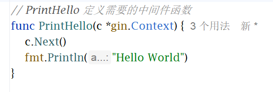

如果使用`c.Next`，就说明跳过了下面的代码，先执行请求，请求执行完毕后回到这个函数，继续执行下面的代码。

如果使用`c.Abort()`，那么当前中间件执行完毕后，就不会继续向后执行，而是直接停止程序。

同样的，如果在路由组中使用中间件，就只有当前的路由组会执行中间件，其他组不会。

和路由分组一样，中间件最好在middleware包下定义。

在middle下的`init.go`中定义下面的中间件。

```go
package middle

import (
	"fmt"
	"time"

	"github.com/gin-gonic/gin"
)

func InitMiddleware(c *gin.Context) {
	fmt.Println(time.Now())
	fmt.Println("请求路径: ", c.Request.URL)
}

func PrintHello(c *gin.Context) {
	fmt.Println("Hello World")
}
```

然后在`main.go`中使用即可。

```go
package main

import (
	"Golang-learn/Demo5_middleware/middle"

	"github.com/gin-gonic/gin"
)

func main() {
	r := gin.Default()
	// 全局使用中间件
	r.Use(middle.InitMiddleware)
	// 针对某个请求使用中间件
	r.GET("/", func(c *gin.Context) {
		c.String(200, "首页")
	}, middle.PrintHello)

	r.Run(":8080")
}
```

### 1.5.1 中间件数据共享

想要共享数据，使用上下文即可，所有中间件和请求共享一个上下文`*gin.Context`。

```go
c.Set("username", "张三")
fmt.Println(c.Get("username")) // 张三
```

## 1.6 自定义Model

如果项目比较简单，可以在Controller中处理业务逻辑。但如果比较复杂，多个业务存在重复的功能，那么可以把公共的功能抽取出来作为一个模块。

比如打印时间`PrintTime`在多个功能中均使用到，就把这个函数放到`models`包下，在其他功能中调用`models.PrintTime`即可。

## 1.7 文件上传

这里需要实现文件的上传。

首先在templates下准备好输入用户名和头像。

```html
<!DOCTYPE html>
<html lang="en">
<head>
    <meta charset="UTF-8">
    <title>Title</title>
</head>
<body>
    <p>示例{{.message}}</p>
    <form action="/doUpload" method="post" enctype="multipart/form-data">
        用户名：<input type="text" name="username", placeholder="用户名"><br><br>
        头像：<input type="file" name="face"><br><br>
        <input type="submit" value="提交">
    </form>
</body>
</html>
```

然后在一个路径展示页面，一个路径在点击跳转后执行文件上传即可。

```go
package main

import (
	"log"

	"github.com/gin-gonic/gin"
)

func main() {
	router := gin.Default()
	// 指定最大上传文件大小为8MB
	router.MaxMultipartMemory = 8 << 20
	// 指定静态页面的位置
	router.LoadHTMLGlob("templates/*")
	// 指定上传接口，用来展示上传图片的页面
	router.GET("/upload", func(c *gin.Context) {
		c.HTML(200, "index.html", gin.H{})
	})
	// 点击页面的提交按钮后，执行下面的请求
	router.POST("/doUpload", func(c *gin.Context) {
		// 从上下文中读取上传的文件
		file, err := c.FormFile("face")
		if err != nil {
			c.String(200, "upload failed")
		}
		log.Println(file.Filename)
		// 将文件保存到当前项目的upload目录下
		err = c.SaveUploadedFile(file, "./upload/"+file.Filename)
		if err != nil {
			c.String(400, "failed to save file")
			return
		}
		c.String(200, "上传成功")
	})
	router.Run(":8080")
}
```

### 1.7.1 多文件上传

多文件上传比较简单，在页面中保证多个file标签的name一致即可。

```html
<!DOCTYPE html>
<html lang="en">
<head>
    <meta charset="UTF-8">
    <title>Title</title>
</head>
<body>
    <p>示例{{.message}}</p>
    <form action="/doUpload" method="post" enctype="multipart/form-data">
        用户名：<input type="text" name="username", placeholder="用户名"><br><br>
        头像：<input type="file" name="face"><br><br>
        <input type="file" name="face"><br><br>
        <input type="file" name="face"><br><br>
        <input type="submit" value="提交">
    </form>
</body>
</html>
```

然后在接收请求中通过MultipartForm能够读取到当前的表单数据，通过表单数据能够获取文件组，通过文件组即可操作单个文件。

```go
package main

import (
	"log"

	"github.com/gin-gonic/gin"
)

func main() {
	router := gin.Default()
	// 指定最大上传文件大小为8MB
	router.MaxMultipartMemory = 8 << 20
	// 指定静态页面的位置
	router.LoadHTMLGlob("templates/*")
	// 指定上传接口，用来展示上传图片的页面
	router.GET("/upload", func(c *gin.Context) {
		c.HTML(200, "index.html", gin.H{})
	})
	// 点击页面的提交按钮后，执行下面的请求
	router.POST("/doUpload", func(c *gin.Context) {
		// 从上下文中读取上传的文件
		form, _ := c.MultipartForm()
		files := form.File["upload[]"]
		for _, file := range files {
			log.Println(file.Filename)
			// 将文件保存到当前项目的upload目录下
			err := c.SaveUploadedFile(file, "./upload/"+file.Filename)
			if err != nil {
				c.String(400, "failed to save file")
				return
			}
		}
		c.String(200, "上传成功")
	})
	router.Run(":8080")
}
```

## 1.8 Cookie

HTTP是无状态的协议。先后访问两个路径的话，这两次请求不会有任何关系。

因此，为了实现状态，需要通过Cookie或者session来保存信息。

使用Cookie能够保持用户的登录状态、保存用户的历史记录、保存用户的喜好和购物车等。

```go
package itying

import (
	"net/http"

	"github.com/gin-gonic/gin"
)

type DefaultController struct{}

func (con DefaultController) Index(c *gin.Context) {
	//设置cookie
	//3600表示的是秒
	c.SetCookie("username", "张三", 3600, "/", "localhost", false, true)

	//过期时间延时
	c.SetCookie("hobby", "吃饭 睡觉", 5, "/", "localhost", false, true)

	c.HTML(http.StatusOK, "default/index.html", gin.H{
		"msg": "我是一个msg",
		"t":   1629788418,
	})
}
func (con DefaultController) News(c *gin.Context) {
	//获取cookie
	username, _ := c.Cookie("username")
	hobby, _ := c.Cookie("hobby")
	c.String(200, "username=%v----hobby=%v", username, hobby)
}

func (con DefaultController) Shop(c *gin.Context) {
	//获取cookie
	username, _ := c.Cookie("username")
	hobby, _ := c.Cookie("hobby")
	c.String(200, "username=%v----hobby=%v", username, hobby)
}
func (con DefaultController) DeleteCookie(c *gin.Context) {
	//删除cookie
	c.SetCookie("username", "张三", -1, "/", "localhost", false, true)
	c.String(200, "删除成功")
}
```

这里setCookie有多个参数。参数name表示键，value表示值，maxAge表示存储最大秒数，path表示访问路径，domain表示哪些路径可以访问，secure表示是否在http中保存cookie，否则只在https中保存，httpOnly表示能否通过js脚本等读取cookie信息。

删除Cookie只需要重新设置对应的Cookie，设置时间为-1即可。

## 1.9 Session

Session是将记录保存在服务器上，而不像Cookie保存在浏览器。

客户端浏览器访问服务器发送请求时，服务器会创建一个session，将用户的请求以key-value的形式生成，将value保存在服务器上，将key返回到浏览器。这样，浏览器访问时会携带key，可以在浏览器上找到对应的value。

```cmd
go get github.com/gin-contrib/sessions
```

首先随意构建一个双层架构。

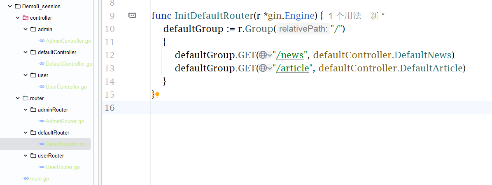

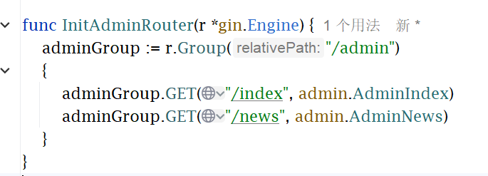

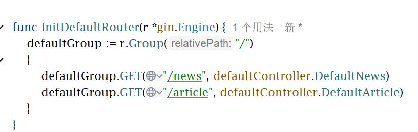

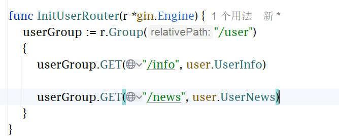

首先如果想要用session，需要先配置中间件。

接下来，就可以通过上下文取出session，通过set和save保存键值对，然后使用get来取出信息。

接下来在UserController中使用session。

```go
package user

import (
	"github.com/bytedance/gopkg/util/logger"
	"github.com/gin-contrib/sessions"
	"github.com/gin-gonic/gin"
)

func UserInfo(c *gin.Context) {
	// 取出session对象
	session := sessions.Default(c)
	// 使用session对象来设置数据
	session.Set("username", "张三")
	// 设置完数据后，需要调用session.Save()方法来保存数据
	err := session.Save()
	if err != nil {
		logger.Warn("session save failed, err: %v", err)
	}
	c.JSON(200, gin.H{
		"msg": "user info",
	})
}

func UserNews(c *gin.Context) {
	// 取出session对象
	session := sessions.Default(c)
	// 通过session对象来获取数据
	username := session.Get("username")
	c.JSON(200, gin.H{
		"msg":      "user news",
		"username": username,
	})
}
```

### 1.9.1 配置到Redis

如果要使用Redis来保存session，只需在设置中间件时更换为redis即可。

```go
package main

import (
	"Golang-learn/Demo8_session/router/adminRouter"
	"Golang-learn/Demo8_session/router/defaultRouter"
	"Golang-learn/Demo8_session/router/userRouter"

	"github.com/gin-contrib/sessions"
	"github.com/gin-contrib/sessions/redis"
	"github.com/gin-gonic/gin"
)

func main() {
	router := gin.Default()
	// 配置session中间件
	// cookie.NewStore 表示将session保存到浏览器的Cookie中,密钥选择为secret123
	store, _ := redis.NewStore(10, "tcp", "localhost:6379", "", "", []byte("secret123"))
	// 设置Session在Cookie的保存名称，可通过sessions.Default(c)来获取这个session对象
	router.Use(sessions.Sessions("mysession", store))

	userRouter.InitUserRouter(router)
	adminRouter.InitAdminRouter(router)
	defaultRouter.InitDefaultRouter(router)
	router.Run(":8080")
}
```

需要保证Docker的Redis开启。

在Redis中能够看到保存的session。

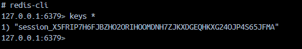

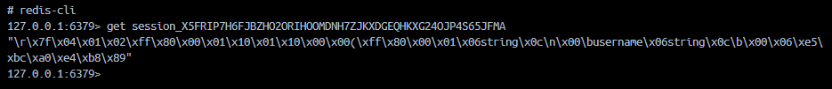

## 1.10 GORM增删改查

GORM用于建立结构体到数据库表的映射。

```cmd
go get -u gorm.io/gorm
go get -u gorm.io/driver/sqlite
go get gorm.io/driver/mysql
```

首先创建数据库。

```mysql
create database `gin`;
use `gin`;
create table `user`(
    `id` int not null auto_increment primary key,
    `username` varchar(255),
    `age` tinyint,
    `email` varchar(255),
    `add_time` int not null default 0
);
```

首先以上面的session为基础，在UserRouter中添加`userGroup.POST("/create", user.CreateUser)`，用来实现往数据库添加数据。

为了使用GORM，需要先连接数据库。在model的`core.go`中进行连接。

```go
package model

import (
	"github.com/bytedance/gopkg/util/logger"
	"gorm.io/driver/mysql"
	"gorm.io/gorm"
)

var DB *gorm.DB
var err error

func InitMySQL() {
	dsn := "root:jia.1113.me.@tcp(127.0.0.1:3307)/gin?charset-utf8mb4&parseTime=True&loc=Local"
	DB, err = gorm.Open(mysql.Open(dsn), &gorm.Config{})
	if err != nil {
		logger.Error(err.Error())
	}
}
```

这里是3307的原因是没有使用本地mysql，使用的是docker的mysql。

然后在model下创建`user.go`，用来实现从数据库到结构体的映射。

```go
package models

// User 用户模型
type User struct {
	Id       int
	Username string
	Age      int
	Email    string
	AddTime  int
}

// TableName 接口，指定表名
func (User) TableName() string {
	return "user"
}
```

接着修改user的Controller和Router，用来实现增删改查。

```go
package user

import (
	"github.com/bytedance/gopkg/util/logger"
	"github.com/gin-contrib/sessions"
	"github.com/gin-gonic/gin"
)

func UserInfo(c *gin.Context) {
	// 取出session对象
	session := sessions.Default(c)
	// 使用session对象来设置数据
	session.Set("username", "张三")
	// 设置完数据后，需要调用session.Save()方法来保存数据
	err := session.Save()
	if err != nil {
		logger.Warn("session save failed, err: %v", err)
	}
	c.JSON(200, gin.H{
		"msg": "user info",
	})
}

func UserNews(c *gin.Context) {
	// 取出session对象
	session := sessions.Default(c)
	// 通过session对象来获取数据
	username := session.Get("username")
	c.JSON(200, gin.H{
		"msg":      "user news",
		"username": username,
	})
}

func CreateUser(c *gin.Context) {
	c.JSON(200, gin.H{
		"msg": "create user",
	})
}

func ShowUser(c *gin.Context) {
	c.JSON(200, gin.H{
		"msg": "show user",
	})
}

func EditUser(c *gin.Context) {
	c.JSON(200, gin.H{
		"msg": "edit user",
	})
}

func DeleteUser(c *gin.Context) {
	c.JSON(200, gin.H{
		"msg": "delete user",
	})
}
```

```go
package userRouter

import (
	"Golang-learn/Demo9_gorm/controller/user"

	"github.com/gin-gonic/gin"
)

func InitUserRouter(r *gin.Engine) {
	userGroup := r.Group("/user")
	{
		userGroup.GET("/info", user.UserInfo)

		userGroup.GET("/news", user.UserNews)

		userGroup.POST("/create", user.CreateUser)

		userGroup.PUT("/edit", user.EditUser)

		userGroup.DELETE("/delete", user.DeleteUser)
		
		userGroup.GET("/show", user.ShowUser)
	}
}
```

接下来需要在Controller中实现增删改查的方法。

1. 查询所有用户。

```go
// ShowUser 查询所有用户
func ShowUser(c *gin.Context) {
	// 查询数据库
	var userList []models.User

	models.DB.Find(&userList)
	
	// 筛选年龄大于20的
	//models.DB.Where("age > ?", 20).Find(&userList)

	c.JSON(http.StatusOK, gin.H{
		"result": userList,
	})
}
```

这样，就能实现用户的查询功能。如果需要实现条件查询，可以使用`models.DB.Where`。

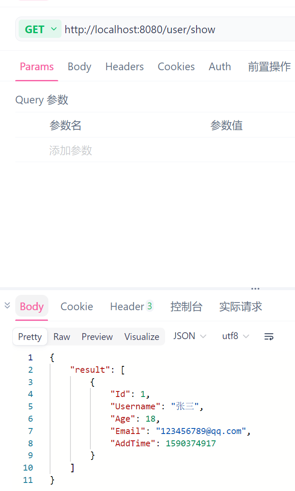

2. 新增用户。

```go
// CreateUser 新增用户
func CreateUser(c *gin.Context) {
	// 模拟新增用户
	user := models.User{
		Username: "李四",
		Age:      20,
		AddTime:  int(time.Now().Unix()),
	}
	// 新增用户到数据库
	models.DB.Create(&user)
	c.JSON(200, gin.H{
		"msg": "create user success",
	})
}
```

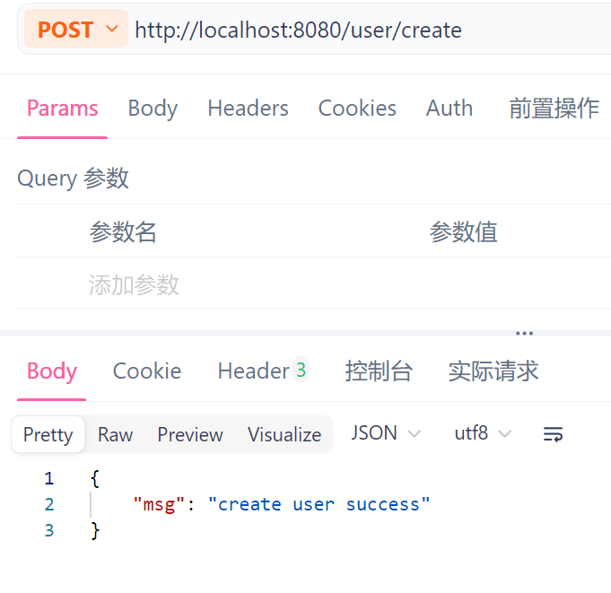

3. 修改用户。

```go
// EditUser 更新用户
func EditUser(c *gin.Context) {
	// 获取用户
	user := models.User{Id: 2}
	models.DB.Find(&user)
	// 设置更新后的用户信息
	user.Username = "王五"
	models.DB.Save(&user)
	// 更新用户
	models.DB.Updates(&user).Where("id=?", 2)
	c.JSON(200, gin.H{
		"msg": "edit user success",
	})
}
```

一般情况下，浏览器中需要更新用户时，仅有用户的id。因此，需要实现根据用户id查找用户的全部信息，然后修改信息，最后再调用`Save()`来保存新的信息。

4. 删除用户。

```go
// DeleteUser 删除用户
func DeleteUser(c *gin.Context) {
	// 先获取用户id
	user := models.User{Id: 3}
	// 只需要id即可实现删除
	models.DB.Delete(&user)
	
	c.JSON(200, gin.H{
		"msg": "delete user success",
	})
}
```

由于删除操作不需要太多操作，可以根据当前用户的id来执行删除。

## 1.11 添加查询条件

如果不需要查询所有的字段，只需要查询部分的字段，可以使用Select。

```go
models.DB.Select("id, title").Find(&userList)
```

如果需要升序或者降序排列，可以使用Order来指定。

```go
models.DB.Order("id desc").Find(&userList)
```

如果要间隔查询，跳过前面的数据进行查询，可以使用Offset。

```go
models.DB.Order("id desc").Offset(1).Limit(2).Find(&userList)
```

> 如果存在1-5id的User，这会使id为1的被跳过，然后根据limit的2，会向后读取两个User，最终2和3被读取出来。

查询总数使用Count。

```go
models.DB.Find(&userList).Count(&num)
```

如果使用方法不方便，可以使用原生SQL语句。

```go
models.DB.Raw("SELECT id, name, age FROM user WHERE id = ?", 3).Scan(&result)
```

这种是需要接收原生SQL语句的返回数据。如果不需要返回数据，使用Exec即可。

```go
models.DB.Exec("DELETE FROM user WHERE id = ?", 5)
```

## 1.12 表关联查询

```mysql
use `gin`;
create table `article`(
    id int not null auto_increment primary key,
    title varchar(255),
    article_cate_id int,
    state int
);
create table `article_cate`(
    id int not null auto_increment primary key,
    title varchar(255),
    state int
)
```

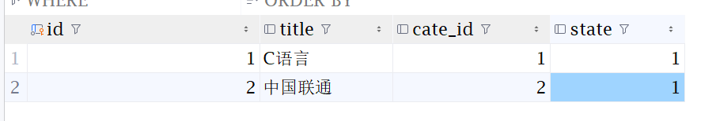

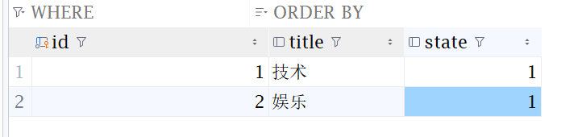

这个article保存的是分类的id，现在需要实现查询时能够查询article的同时，将cate_id替换为分类。

原生MySQL能够通过下面的语句实现关联查询。

```mysql
select a.title, c.title, a.state from article as a join article_cate as c on a.cate_id = c.id;
```

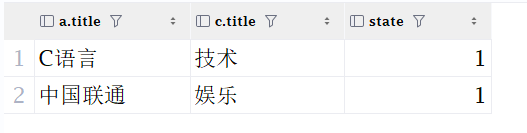

这样，需要准备article和article_cate的model。

```go
package models

type Article struct {
	Id            int
	Title         string
	ArticleCateId int
	State         int
	ArticleCate   ArticleCate
}

func (Article) TableName() string {
	return "article"
}
```

```go
package models

type ArticleCate struct {
	Id    int
	Title string
	State int
}

func (ArticleCate) TableName() string {
	return "article_cate"
}
```

这样，就算是实现了数据库表对应的结构体。其中，为了实现关联查询，Article结构体需要添加ArticleCateId作为外检，以及保存ArticleCate结构体来进行关联。

那么，在articleController中实现关联查询。

```go
package controller

import (
	"Golang-learn/Demo10_mysql_table/models"

	"github.com/gin-gonic/gin"
)

type ArticleController struct {
	BaseController
}

func (ArticleController) List(c *gin.Context) {

	var articleList []models.Article
	// Preload 用于关联查询，在执行Find查询前，先预查询ArticleCate的记录，然后根据外键ArticleCateId来关联查询ArticleCate的记录
	models.DB.Preload("ArticleCate").Find(&articleList)
	c.JSON(200, gin.H{
		"articleList": articleList,
	})

}
```

> 这样，通过Preload能够先通过`SELECT * FROM article_cate`来查询`article_cate`表，然后根据结构体中设置的外键`ArticleCateId`来作为外键进行关联，使得article表的`article_cate_id`与`article_cate`的id进行匹配。

Preload方法需要注意，在article结构体中需要绑定关联查询表的结构体和外键才能进行关联查询。

而如果外键的名字比较混乱，Gin无法识别，那么就需要手动指定外键。

```go
package models

type Article struct {
	Id            int
	Title         string
	CateId 		int
	State         int
    ArticleCate   ArticleCate `gorm:"foreignKey:CateId"`
}

func (Article) TableName() string {
	return "article"
}
```

这样显式指定，Gin就能识别到外键。

接下来还有另一个方向的查询，查询ArticleCate能够获取文章。

```go
package models

type ArticleCate struct {
	Id    int
	Title string
	State int
	Article []Article `gorm:"foreignkey:ArticleCateId"`
}

func (ArticleCate) TableName() string {
	return "article_cate"
}
```

这样，能够将当前的Article与ArticleCateId进行关联，能够一并查询出来。

```go
package controller

import (
	"Golang-learn/Demo10_mysql_table/models"

	"github.com/gin-gonic/gin"
)

type ArticleController struct {
	BaseController
}

func (ArticleController) List(c *gin.Context) {

	var articleList []models.Article
	// Preload 用于关联查询，在执行Find查询前，先预查询ArticleCate的记录，然后根据外键ArticleCateId来关联查询ArticleCate的记录
	models.DB.Preload("ArticleCate").Find(&articleList)
	c.JSON(200, gin.H{
		"articleList": articleList,
	})
}

func (ArticleController) ArticleCateList(c *gin.Context) {
	var articleCateList []models.ArticleCate
	// 先通过Preload预查询Article记录，然后再根据外键ArticleCateId来关联查询ArticleCate的记录
	models.DB.Preload("Article").Find(&articleCateList)
	c.JSON(200, gin.H{
		"articleCateList": articleCateList,
	})
}
```


## 1.12 GORM事务

GORM中默认在事务中执行写入操作。如果不需要事务的话，可以进行关闭。

```go
package models

import (
	"github.com/bytedance/gopkg/util/logger"
	"gorm.io/driver/mysql"
	"gorm.io/gorm"
)

var DB *gorm.DB
var err error

func InitMySQL() {
	dsn := "root:jia.1113.me.@tcp(127.0.0.1:3307)/gin?charset-utf8mb4&parseTime=True&loc=Local"
	DB, err = gorm.Open(mysql.Open(dsn), &gorm.Config{
        // 禁用事务
		SkipDefaultTransaction: true,
	})
	if err != nil {
		logger.Error(err.Error())
	}
}
```

现在使用user表，准备给表里的人的age均添加1。

```go
package controller

import (
	"Golang-learn/Demo11_transaction/models"

	"github.com/bytedance/gopkg/util/logger"
	"github.com/gin-gonic/gin"
)

type UserController struct {
}

func (UserController) UserInfo(c *gin.Context) {

	// 开启事务
	tx := models.DB.Begin()

	// id为1的人age涨1岁
	user := models.User{Id: 1}
	tx.Find(&user)
	user.Age += 1
	tx.Save(&user)

	// 触发异常，此时程序会继续执行，如果不显式调用Rollback()，则会运行后面的Commit，导致错误的数据被提交
	if true {
		tx.Rollback()
		logger.Error("error")
	}

	// 触发错误
	defer func() {
		if r := recover(); r != nil {
			tx.Rollback()
		}
	}()
	if true {panic("panic")}
	// id为2的人age涨1岁
	user = models.User{Id: 2}
	tx.Find(&user)
	user.Age += 1
	tx.Save(&user)

	// 事务提交
	tx.Commit()

	c.JSON(200, gin.H{
		"message": "user info",
	})
}
```

在这里由于Gin的事务属于单语句的，每条语句单独使用事务，因此会出现第一个用户更新了age，而第二个用户没有更新age，就导致了数据库不一致。其中需要使用事务的操作使用`tx`来代替`models.DB`来进行操作。

## 1.13 go-ini

### 1.13.1 读取ini配置文件

对于go来说，ini配置文件的读取效率比yaml读取效率更高，go-ini比Viper更轻量。

ini配置文件写在conf包下的`app.ini`。

```ini
app_name = Demo12_ini

log_level = DEBUG

[mysql]
ip = 127.0.0.1
port = 3307
user = root
password = jia.1113.me.
database = gin

[redis]
ip = 127.0.0.1
port = 6379
```

```cmd
go get gopkg.in/ini.v1
```

然后使用`ini.Load()`即可。

```go
package models

import (
	"fmt"

	"github.com/bytedance/gopkg/util/logger"
	"gopkg.in/ini.v1"
	"gorm.io/driver/mysql"
	"gorm.io/gorm"
)

var DB *gorm.DB
var err error

func InitMySQL() {
	config, err := ini.Load("./Demo12_ini/config/app.ini")
	if err != nil {
		logger.Error(err.Error())
	}
	username := config.Section("mysql").Key("user").String()
	password := config.Section("mysql").Key("password").String()
	ip := config.Section("mysql").Key("ip").String()
	port := config.Section("mysql").Key("port").String()
	database := config.Section("mysql").Key("database").String()

	dsn := fmt.Sprintf("%v:%v@tcp(%v:%v)/%v?charset=utf8mb4&parseTime=True&loc=Local",
		username, password, ip, port, database)
	DB, err = gorm.Open(mysql.Open(dsn), &gorm.Config{})
	if err != nil {
		logger.Error(err.Error())
	}
}
```

这里能够看到，首先通过`ini.Load()`读取到配置文件，然后通过Section来获取到需要的分区，如mysql分区表示`[mysql]`下的属性，再通过`Key`来根据键名来获取值。

### 1.13.2 写入配置文件

还有一些要求，可能需要写入当前的配置文件中。

```go
package main

import (
	"Golang-learn/Demo12_ini/models"
	"Golang-learn/Demo12_ini/router"

	"github.com/bytedance/gopkg/util/logger"
	"github.com/gin-gonic/gin"
	"gopkg.in/ini.v1"
)

func main() {
	r := gin.Default()
	models.InitMySQL()
	router.InitUserRouter(r)
	config, err := ini.Load("./Demo12_ini/config/app.ini")
	if err != nil {
		logger.Error(err.Error())
	}
	config.Section("").Key("set_new_key").SetValue("new_value")
	// 写完后需要保存
	err = config.SaveTo("./Demo12_ini/config/app.ini")
	if err != nil {
		logger.Error(err.Error())
	}
	r.Run()
}
```

这样，就能写入新的配置信息。

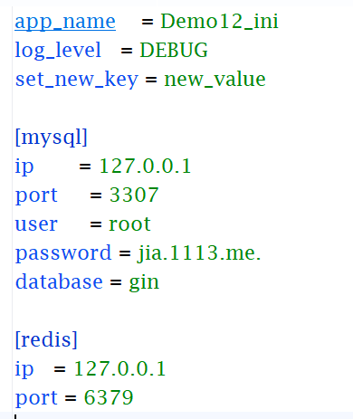

# 2. 微服务

微服务就是将系统通过组件化的方式进行拆分。

**接下来是go-micro和go+k8s，这两个需要付费，因此结束。**
